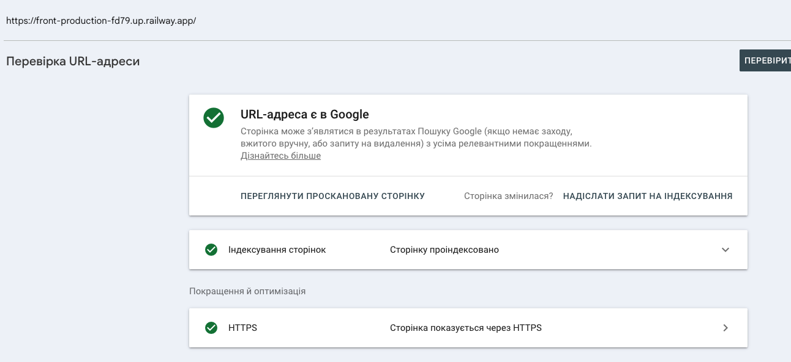
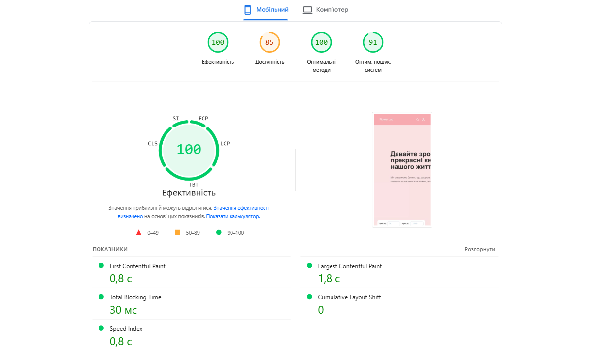
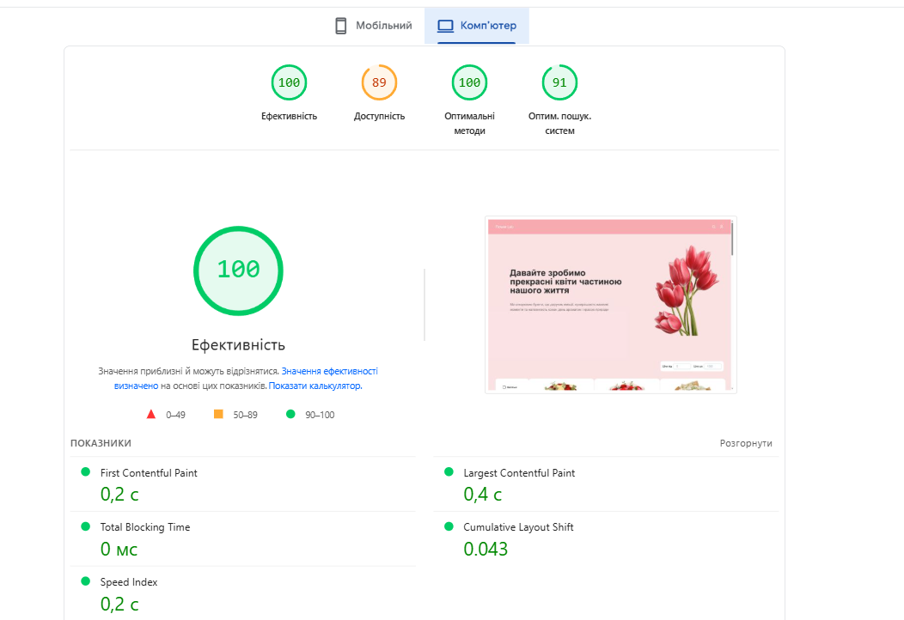

# Звіт лабораторної роботи №2

## 1. Скріншот URL Inspection з GSC (головна сторінка)

## 2. Результати site:, cache:, info: операторів

[Site & Cache & Info](https://docs.google.com/spreadsheets/d/1IWLYZXXtQiL8Pp_jhzEf_iIi2EM6jCHqM8kHAXyUsVU/edit?gid=818980981#gid=818980981)

## 3. Заповнена таблиця статусів Coverage Report з поясненнями

[GSC Coverage Report](https://docs.google.com/spreadsheets/d/1IWLYZXXtQiL8Pp_jhzEf_iIi2EM6jCHqM8kHAXyUsVU/edit?gid=1438801155#gid=1438801155)

## 4. Таблиця алгоритмів Google з реальними кейсами

[Google Algorithms](https://docs.google.com/spreadsheets/d/1IWLYZXXtQiL8Pp_jhzEf_iIi2EM6jCHqM8kHAXyUsVU/edit?gid=1280180942#gid=1280180942)

## 5. Скріншот сторінки /about
... in development

## 6. Скріншот профілю флористів
... in development

## 7. Заповнений E-E-A-T чек-ліст

[E-E-E-T Check-list](https://docs.google.com/spreadsheets/d/1IWLYZXXtQiL8Pp_jhzEf_iIi2EM6jCHqM8kHAXyUsVU/edit?gid=1210148623#gid=1210148623)

## 8. Скріншоти PageSpeed Insights (Mobile + Desktop)

## 9. Заповнена таблиця Lighthouse метрик

[Lighthouse](https://docs.google.com/spreadsheets/d/1IWLYZXXtQiL8Pp_jhzEf_iIi2EM6jCHqM8kHAXyUsVU/edit?gid=1447889695#gid=1447889695)

## 10. Аналіз результатів Lighthouse

_Які метрики у червоній зоні? Що це означає для користувача?_

червоних (critical) метрик — немає усі показники знаходяться у зеленій або жовтій зоні

Для користувача:

- бачить сторінку швидко (швидкий FCP, LCP)
- отримує нормальний відгук на взаємодію (INP)
- не стикається зі стрибками layout (CLS ≈ 0)

Загалом UX високої якості, але є невеликі затримки при взаємодії на мобільних пристроях.

_Які три проблеми PageSpeed вважає найкритичнішими?_

По-перше, це час відповіді сервера (TTFB), який на мобільних пристроях становить 0,9 секунди, що може бути пов’язано з відсутністю ефективного кешування або затримками на стороні бекенду. По-друге, показник INP (Interaction to Next Paint), який відображає швидкість реакції інтерфейсу на дії користувача; його значення на мобільних пристроях є дещо вищим, що може бути спричинено складними JavaScript-операціями або надмірною кількістю ререндерів. По-третє, показник Accessibility (85–89 балів), який свідчить про наявність певних проблем з доступністю інтерфейсу, таких як недостатній контраст, відсутність aria-атрибутів або некоректне використання форм.

_Порівняй результати Mobile vs Desktop - чому вони відрізняються?_

Порівняння результатів для Mobile та Desktop демонструє, що мобільна версія має гірші показники майже за всіма метриками. Зокрема, LCP на мобільних пристроях становить 1,8 секунди проти 0,4 секунди на десктопі, FCP — 0,8 секунди проти 0,2 секунди, а також спостерігається більший час відповіді сервера. Основними причинами таких відмінностей є обмежена обчислювальна потужність мобільних пристроїв, повільніше мережеве з’єднання, а також використання в Lighthouse спеціального throttling (штучного уповільнення CPU та мережі) для моделювання реальних умов використання. У результаті навіть добре оптимізований веб-додаток може демонструвати нижчі показники на мобільних пристроях, що є типовою ситуацією.

## Контрольні запитання

[Контрольні запитання](https://docs.google.com/spreadsheets/d/1IWLYZXXtQiL8Pp_jhzEf_iIi2EM6jCHqM8kHAXyUsVU/edit?gid=1881976706#gid=1881976706)
